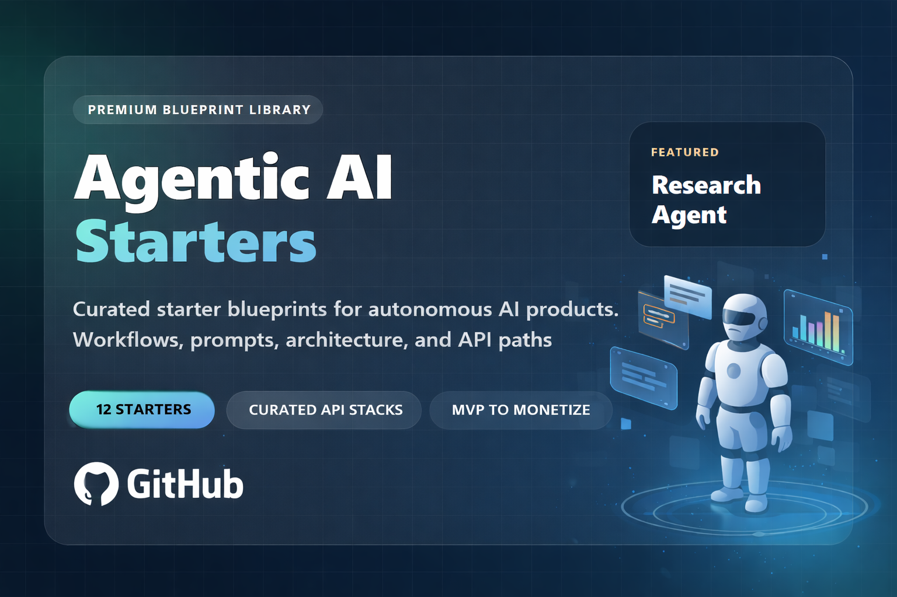

<div align="center">
  
</div>

<div align="center">

# Agentic AI Starters

**A premium blueprint library for building autonomous AI products with real APIs, real workflows, and real monetization paths.**

[](https://github.com/cporter202/agentic-ai-starters/stargazers)
[](https://github.com/cporter202/agentic-ai-starters/network/members)
[](https://github.com/cporter202/agentic-ai-starters/commits/main)
[](./LICENSE)

[](#curated-stack-paths)
[](#featured-starters)
[](#what-you-get-in-each-starter)
[](#how-to-use-this-repo)
[](#why-this-repo-is-valuable)

[Explore Starters](#featured-starters) | [Browse Categories](#starter-categories) | [View Stack Paths](#curated-stack-paths) | [See Star History](#star-history)

</div>

## Navigation

| Jump to | What you will find |
| --- | --- |
| [What You Can Build](#what-you-can-build) | The big-picture positioning and why this repo exists |
| [Featured Starters](#featured-starters) | The highest-value starter blueprints in the library |
| [Starter Categories](#starter-categories) | A cleaner way to browse by use case |
| [Curated Stack Paths](#curated-stack-paths) | Collapsible sections with practical stack direction |
| [How To Use This Repo](#how-to-use-this-repo) | The fastest path from repo to MVP |
| [Star History](#star-history) | Stargazer chart and social proof block |

## Topics


## What You Can Build

This repository is not a raw API dump and not another giant directory of random tools.

It is a **curated collection of plug-and-play starter blueprints** for founders, agencies, operators, indie hackers, and product teams who want to build autonomous AI applications that feel like real products.

Instead of asking:

- which of these 10,000 APIs should I even care about?
- how do I turn a cool model into an actual workflow?
- what does an MVP stack for this category look like?

This repo answers:

- what to build
- who it is for
- how the workflow should run
- which APIs belong in the stack
- which recommended APIs are worth clicking into first
- how to move from concept to MVP to monetizable product

If you want the full API catalog, use the main [API Mega List](https://github.com/cporter202/API-mega-list). This repo is the opinionated build layer on top of that broader catalog.

## Featured Starters

<table>
  <tr>
    <td width="50%">
      <h3><a href="./starters/research-agent/">Research Agent</a></h3>
      <p>Citation-first research workflows for market scans, strategy briefs, and web intelligence.</p>
    </td>
    <td width="50%">
      <h3><a href="./starters/lead-gen-agent/">Lead Gen Agent</a></h3>
      <p>Discover, enrich, score, and route outreach-ready leads with stronger sourcing paths.</p>
    </td>
  </tr>
  <tr>
    <td width="50%">
      <h3><a href="./starters/seo-content-agent/">SEO Content Agent</a></h3>
      <p>Turn search intent, competitor analysis, and prompt systems into a repeatable content engine.</p>
    </td>
    <td width="50%">
      <h3><a href="./starters/social-listening-agent/">Social Listening Agent</a></h3>
      <p>Track conversations, cluster narratives, and surface the mentions that deserve human attention.</p>
    </td>
  </tr>
  <tr>
    <td width="50%">
      <h3><a href="./starters/outreach-agent/">Outreach Agent</a></h3>
      <p>Personalized outbound systems with stronger context, better sequences, and cleaner handoffs.</p>
    </td>
    <td width="50%">
      <h3><a href="./starters/multi-agent-ops-starter/">Multi-Agent Ops Starter</a></h3>
      <p>Production-minded orchestration patterns for planners, workers, reviewers, and operators.</p>
    </td>
  </tr>
</table>

## Starter Categories

<table>
  <tr>
    <td width="33%">
      <h3>Research and Intelligence</h3>
      <p><a href="./starters/research-agent/">research-agent</a><br><a href="./starters/competitor-intel-agent/">competitor-intel-agent</a><br><a href="./starters/social-listening-agent/">social-listening-agent</a></p>
    </td>
    <td width="33%">
      <h3>Revenue and Pipeline</h3>
      <p><a href="./starters/lead-gen-agent/">lead-gen-agent</a><br><a href="./starters/outreach-agent/">outreach-agent</a><br><a href="./starters/customer-support-agent/">customer-support-agent</a></p>
    </td>
    <td width="33%">
      <h3>Content and Growth</h3>
      <p><a href="./starters/seo-content-agent/">seo-content-agent</a><br><a href="./starters/ecommerce-monitor-agent/">ecommerce-monitor-agent</a></p>
    </td>
  </tr>
  <tr>
    <td width="33%">
      <h3>Vertical Operators</h3>
      <p><a href="./starters/job-hunt-agent/">job-hunt-agent</a><br><a href="./starters/real-estate-agent/">real-estate-agent</a></p>
    </td>
    <td width="33%">
      <h3>Systems and Infrastructure</h3>
      <p><a href="./starters/mcp-toolchain-starter/">mcp-toolchain-starter</a><br><a href="./starters/multi-agent-ops-starter/">multi-agent-ops-starter</a></p>
    </td>
    <td width="33%">
      <h3>Business Angle</h3>
      <p>Agency offers<br>Internal tooling<br>SaaS MVPs<br>Productized services<br>Paid research and ops workflows</p>
    </td>
  </tr>
</table>

## What You Get In Each Starter

Every starter is designed to feel actionable instead of empty.

| File | Why it matters |
| --- | --- |
| `README.md` | Product concept, buyer, workflow, inputs, outputs, and why someone would build it |
| `architecture.md` | Clear MVP shape, core components, and implementation direction |
| `prompts.md` | Prompt building blocks, role prompts, and guardrails |
| `stack.md` | Featured API links, companion APIs, and stack tiers |

## Curated Stack Paths

<details>
  <summary><strong>Research and intelligence stacks</strong></summary>

These starters are built for discovery, synthesis, monitoring, and recurring insight generation.

- [research-agent](./starters/research-agent/stack.md): research workflows, citation-first extraction, web synthesis
- [competitor-intel-agent](./starters/competitor-intel-agent/stack.md): competitor tracking, launch monitoring, positioning shifts
- [social-listening-agent](./starters/social-listening-agent/stack.md): channel monitoring, narrative clustering, alerting

Featured paths:

- [AI Web Research Agent](https://apify.com/devwithbobby/ai-web-research-agent?fpr=p2hrc6)
- [Website Content Crawler](https://apify.com/apify/website-content-crawler?fpr=p2hrc6)
- [Google Search API](https://apify.com/api/google-search-api?fpr=p2hrc6)
- [Twitter/X Scraper](https://apify.com/automation-lab/twitter-scraper?fpr=p2hrc6)

</details>

<details>
  <summary><strong>Revenue and pipeline stacks</strong></summary>

These starters are designed for list building, outbound execution, and support flows tied to business outcomes.

- [lead-gen-agent](./starters/lead-gen-agent/stack.md): account discovery, enrichment, qualification
- [outreach-agent](./starters/outreach-agent/stack.md): personalization, sequencing, reply handling
- [customer-support-agent](./starters/customer-support-agent/stack.md): ticket triage, retrieval, draft replies

Featured paths:

- [Linkedin Leads Generator](https://apify.com/contacts-api/linkedin-leads-generator?fpr=p2hrc6)
- [Find B2B Emails for Outreach](https://apify.com/purple_beep_boop/find-b2b-emails-for-outreach?fpr=p2hrc6)
- [LinkedIn Profile Scraper](https://apify.com/automation-lab/linkedin-profile-scraper?fpr=p2hrc6)
- [Trustpilot Scraper](https://apify.com/happitap/trustpilot-scraper?fpr=p2hrc6)

</details>

<details>
  <summary><strong>Content and growth stacks</strong></summary>

These starters help teams turn SERP data, product signals, and market changes into content and growth actions.

- [seo-content-agent](./starters/seo-content-agent/stack.md): topic clustering, SERP analysis, briefs, drafts
- [ecommerce-monitor-agent](./starters/ecommerce-monitor-agent/stack.md): product monitoring, pricing alerts, review summaries

Featured paths:

- [Google Keyword Scraper](https://apify.com/dxbear/google-keyword-scraper?fpr=p2hrc6)
- [Google Search Scraper](https://apify.com/apidojo/google-search-scraper?fpr=p2hrc6)
- [Amazon Product Scraper](https://apify.com/get-leads/amazon-product-scraper?fpr=p2hrc6)
- [Website Content Crawler](https://apify.com/apify/website-content-crawler?fpr=p2hrc6)

</details>

<details>
  <summary><strong>Vertical operator stacks</strong></summary>

These starters package agent workflows around specific categories with real operational use.

- [job-hunt-agent](./starters/job-hunt-agent/stack.md): role discovery, company research, tailored applications
- [real-estate-agent](./starters/real-estate-agent/stack.md): listing monitoring, underwriting notes, market context

Featured paths:

- [LinkedIn Jobs Scraper](https://apify.com/valig/linkedin-jobs-scraper?fpr=p2hrc6)
- [Indeed Jobs Scraper](https://apify.com/valig/indeed-jobs-scraper?fpr=p2hrc6)
- [Zillow Scraper](https://apify.com/mido_99/zillow-scraper?fpr=p2hrc6)
- [Google Maps B2B Leads Scraper](https://apify.com/primeparse/google-maps-scraper?fpr=p2hrc6)

</details>

<details>
  <summary><strong>Systems and infrastructure stacks</strong></summary>

These starters are for teams building serious internal agent systems, toolchains, and orchestration layers.

- [mcp-toolchain-starter](./starters/mcp-toolchain-starter/stack.md): MCP tool surfaces, auditable actions, doc ingestion
- [multi-agent-ops-starter](./starters/multi-agent-ops-starter/stack.md): routers, workers, reviewers, traces, retries

Featured paths:

- [AI Web Scraper](https://apify.com/apify/ai-web-scraper?fpr=p2hrc6)
- [Website Content Crawler](https://apify.com/apify/website-content-crawler?fpr=p2hrc6)
- [AI Web Research Agent](https://apify.com/devwithbobby/ai-web-research-agent?fpr=p2hrc6)
- [Google Search API](https://apify.com/api/google-search-api?fpr=p2hrc6)

</details>

## Why This Repo Is Valuable

This repo is built to shorten the distance between:

- seeing an agent idea
- understanding the workflow
- choosing the right stack
- building the first version
- turning it into something monetizable

It is valuable because it helps you:

- avoid generic AI project ideas with no operational shape
- pick higher-signal API stacks faster
- package agent workflows into agency, SaaS, consulting, or internal tools
- move from research and prompting into architecture and execution
- browse by actual business use case instead of random API categories

## How To Use This Repo

1. Pick a starter based on the product or workflow you want to build.
2. Read that starter's `README.md` to understand the use case and target builder.
3. Review `architecture.md` for the MVP shape.
4. Use `prompts.md` to seed your planner, worker, reviewer, and QA loops.
5. Open `stack.md` to choose a lean, best-value, or premium path.
6. Replace the starter assumptions with your own auth, storage, UI, and business logic.

## Recommended Reading Order

| If you are... | Start here |
| --- | --- |
| Building a research or monitoring tool | [research-agent](./starters/research-agent/) or [competitor-intel-agent](./starters/competitor-intel-agent/) |
| Building a sales or service workflow | [lead-gen-agent](./starters/lead-gen-agent/) or [outreach-agent](./starters/outreach-agent/) |
| Building growth automation | [seo-content-agent](./starters/seo-content-agent/) or [ecommerce-monitor-agent](./starters/ecommerce-monitor-agent/) |
| Building infra for agents | [mcp-toolchain-starter](./starters/mcp-toolchain-starter/) or [multi-agent-ops-starter](./starters/multi-agent-ops-starter/) |

## Repo Structure

```text
agentic-ai-starters/
|- README.md
|- LICENSE
|- .gitignore
|- assets/
|  |- readme-hero.svg
|- docs/
|- prompts/
|- templates/
|- starters/
   |- research-agent/
   |- lead-gen-agent/
   |- seo-content-agent/
   |- social-listening-agent/
   |- ecommerce-monitor-agent/
   |- competitor-intel-agent/
   |- job-hunt-agent/
   |- real-estate-agent/
   |- outreach-agent/
   |- customer-support-agent/
   |- mcp-toolchain-starter/
   |- multi-agent-ops-starter/
```

## Star History

[](https://star-history.com/#cporter202/agentic-ai-starters&Date)

## Notes

- This repository is intentionally curated and opinionated.
- APIs still matter here, but only when they belong inside an actual build path.
- The main [API Mega List](https://github.com/cporter202/API-mega-list) is still the place to browse the full catalog.
